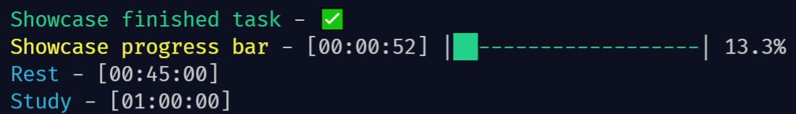

# Timer List

## Description

A python CLI tool to split and manage time efficiently. The idea is to monitor intervals of work-rest-work while not needing to constantly reset timers.

### Usage

1. Clone repo
2. Create a `Todo` file (example provided)
3. type `python ./timer_list.py <todo_file_name>`

### Requirements

- Python 3.9.7
